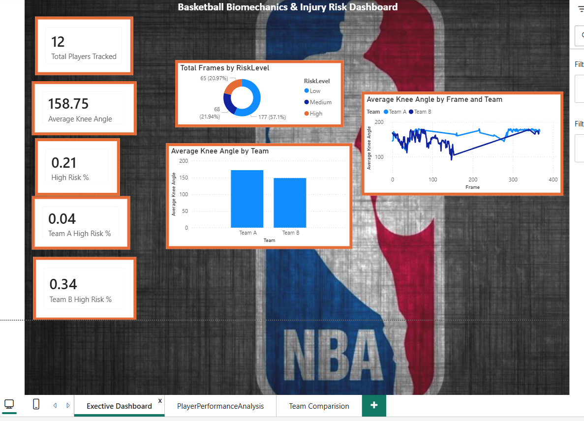
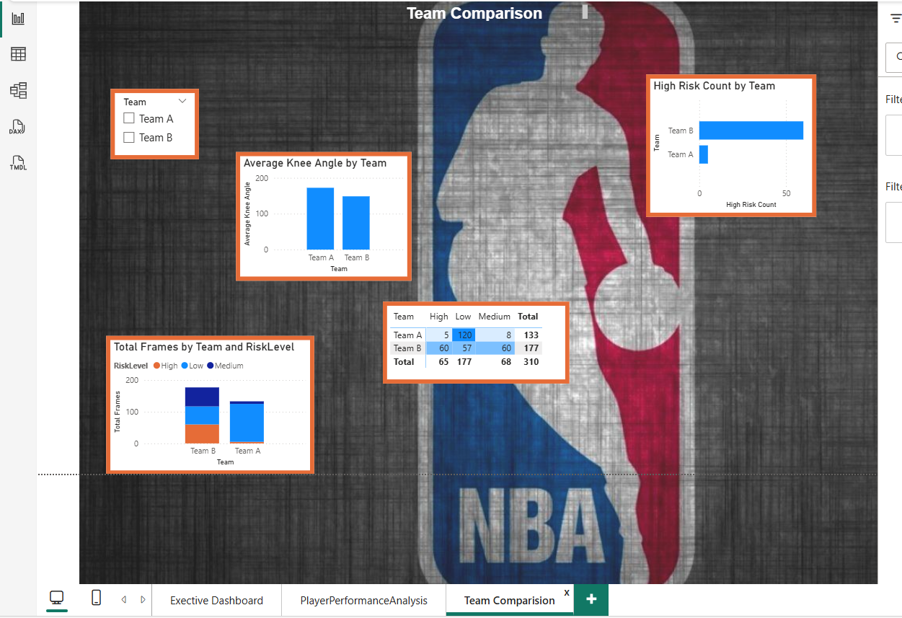
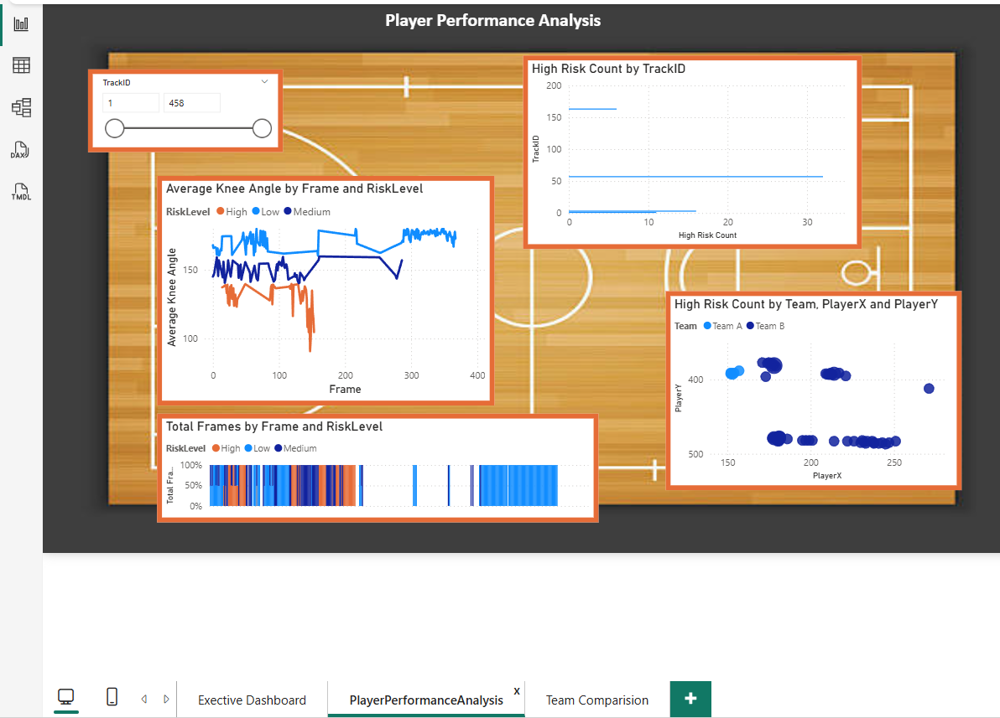

# basketball-computer-vision-analytics
AI Basketball Biomechanics & Injury Risk Analytics

Project Overview

This project combines Computer Vision, biomechanics, and sports analytics to analyse basketball player movement and identify potential injury-risk patterns from match footage.

Using Python, YOLOv8, OpenCV, pose estimation, and Power BI, the project automatically:

detects basketball players
tracks player movement
identifies Team A and Team B
estimates body pose and knee angles
classifies injury-risk levels
visualises sports insights in interactive dashboards

The aim of the project was to explore how AI and video analytics can support:

player performance analysis
biomechanics monitoring
injury prevention
team movement analysis
Business / Sports Problem

Basketball involves:

explosive acceleration
cutting movements
jump landings
defensive transitions

These actions place high stress on the lower body and increase injury risk.

Traditional biomechanics systems often require:

expensive motion capture technology
wearable sensors
laboratory setups

This project explores whether Computer Vision can provide a lower-cost and scalable alternative using standard basketball footage.

Key Question

Can computer vision automatically analyse basketball movement patterns and identify potential injury-risk behaviour from normal game footage?

Tools & Technologies Used
Tool	Purpose
Python	Computer Vision pipeline
YOLOv8	Player detection & tracking
OpenCV	Video processing
NumPy	Biomechanics calculations
Pandas	Data cleaning/export
Jupyter Notebook	Development environment
Power BI	Dashboard visualisation

Project Workflow
1. Video Processing

Basketball match footage was processed frame-by-frame using OpenCV.

2. Player Detection & Tracking

YOLOv8 was used to:

detect players
generate bounding boxes
track player movement across frames

3. Crowd & Referee Removal

Court filtering and body-size filtering were used to remove:

spectators
referees
sideline detections

4. Team Classification

Jersey colour analysis was used to identify:

Team A (Blue jerseys)
Team B (White jerseys)

5. Pose Estimation & Biomechanics

Pose estimation was applied to:

hips
knees
ankles

Knee angles were calculated to estimate movement biomechanics.

6. Injury-Risk Classification
Knee Angle	Risk Level
< 140°	High Risk
140° – 160°	Medium Risk
> 160°	Low Risk

7. Power BI Dashboarding

Tracking and biomechanics data was exported into Power BI to create:

injury-risk dashboards
team comparison analysis
player movement analytics
biomechanics visualisations

Dashboard Pages

Executive Dashboard

Team A vs Team B comparison

Player Performance Analysis

Player Perfromance Analysis:

movement analytics
player positioning
knee angle trends
high-risk player analysis
Team Comparison

Team Comparison:

Team A vs Team B injury-risk comparison
movement behaviour analysis
risk heatmaps
team biomechanics trends

Key Sports Insights
Team B generated significantly more high-risk movement events
Team A demonstrated safer movement mechanics
Certain movement zones showed higher injury-risk exposure
Player positioning and movement clusters were successfully identified
The system detected unstable lower-body movement patterns during high-intensity actions

Challenges Solved
Spectator Detection

Crowd members wearing similar colours were initially detected as players.

Solved using:

court filtering
body-size filtering
positional filtering
Team Misclassification

Some players were incorrectly classified between teams.

Solved using:

jersey colour extraction
RGB threshold filtering
Tracking Consistency

Player IDs occasionally changed across frames.

Solved using:

YOLO tracking persistence
frame optimisation
Final Outcome

The final system successfully:

tracked basketball players
identified teams
estimated biomechanics
classified injury-risk patterns
visualised movement insights in Power BI dashboards

This project demonstrates how AI and sports analytics can be combined to support modern athlete monitoring and performance analysis workflows.

Future Improvements

Potential future enhancements include:

full-court tracking
ball tracking
jump analysis
speed and acceleration tracking
fatigue modelling
real-time analytics
deep learning injury prediction models
Repository Structure
basketball-computer-vision-analytics/
│
├── README.md
├── Computer_Vision_Basketball_Case_Study.docx
├── output_team_tracking_final_strict.mp4
│
└── dashboard_screenshots/
    ├── ExecutiveDashboard.png
    ├── PlayerPerfromanceAnalysis.png
    ├── TeamComparison.png
Portfolio Summary

Developed a computer vision basketball analytics system using Python, YOLOv8, and pose estimation to track player movement, classify teams, estimate knee biomechanics, and identify injury-risk patterns. Exported tracking data into Power BI to build interactive sports performance dashboards analysing team movement behaviour, risk exposure, and player biomechanics.
